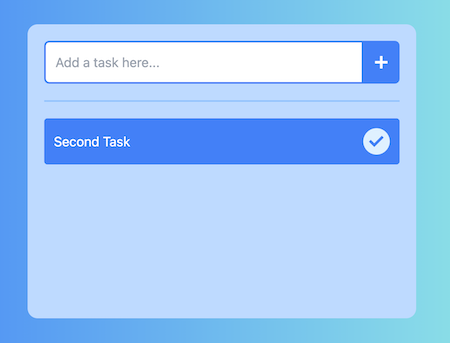

# Todo made with Vite + React + Tailwind
This is just a workaround to explore vite with react and tailwind.

## How to start this project
1. Clone this repository

2. Run `npm install`

3. Run `npm run dev`

This will start a server in http://localhost:5173

# Live preview
Access to this link https://react-todo.lesalvucci.xyz

# Screenshots

## Initial screen

## Adding a new todo

## Todo list and actions when hover

## Todo list with completed todos

## Todo removed

